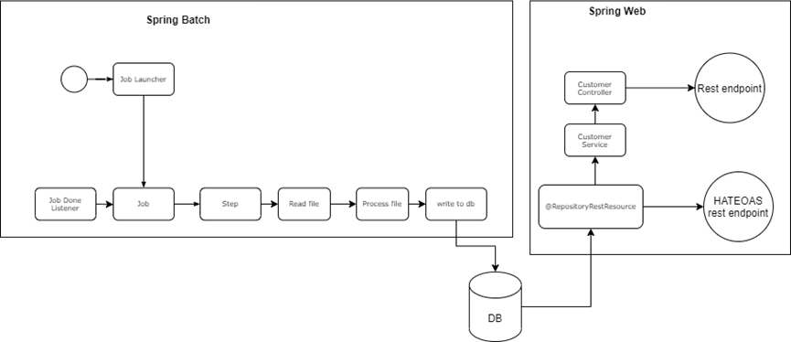
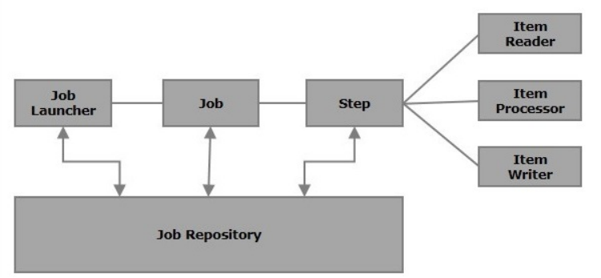
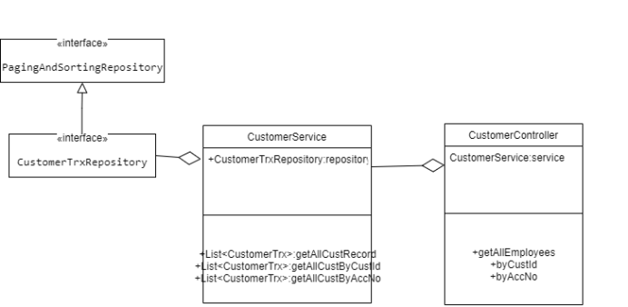
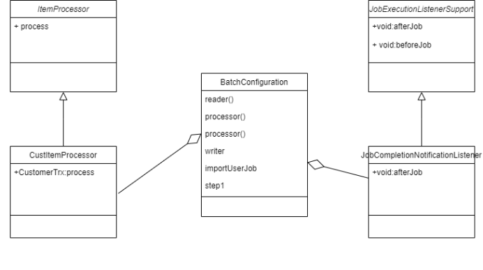
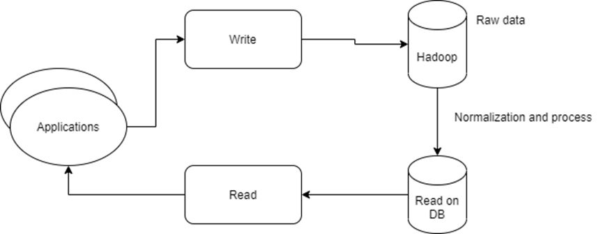

"# springboot-demo" 

This is a spring boot application to demonstrate how to import the data from file via the spring batch and stored into DB. Able to be query via Restful API. The results are paginated.

The flow for the process

The standard component in spring batch

Basic class diagram for spring batch

Class diagram for rest component

<b>Restful API:</b>

This application provide 2 type of rest api, One is define via
@RepositoryRestResource, another is via @RestController

@RepositoryRestResource will create a HATEOAS service with spring JPA. HATEOAS provide pagination and search function.

@RestController will not create a HATEOAS,pagination and search are done in repository object.

<b>Rest API for @RepositoryRestResource</b> 
1.HATEOS top level service 
http://localhost:8080/

2.To see all customer records 
http://localhost:8080/custTrx{?page,size,sort}"

3.Info for search option 
http://localhost:8080/custTrx/search

4.To search by customer id 
http://localhost:8080/custTrx/search/findByCustId{?custId,page,size,sort}

5.To search by account number 
http://localhost:8080/custTrx/search/findByAccNumber{?accNumber,page,size,sort}

<b>Rest API for @RestController</b> 
1. Retrieved all customer 
http://localhost:8080/customers/{?page,size,sort}
   

2. Search by customer id 
http://localhost:8080/customers/custId{?custId, page,size,sort}
   

3. Search by account number 
http://localhost:8080/customers/accNo{?accNumber, page,size,sort}

<b>Additional limitation on this design</b> 
If the spring batch process was running on a monolith system with intense usage of database to read and write data. It might cause the performance issues and deadlock if the same table was access by spring batch and application at the same time.

<b>Suggest solution:</b> 
Microservice architecture with independence database bundle with the microservices could reduce the burden of the database

Implement CQRS/ES design pattern could help to improve the scalability and performance of the application. The downside is the complexity of the design pattern, and might not suitable for every use case.

